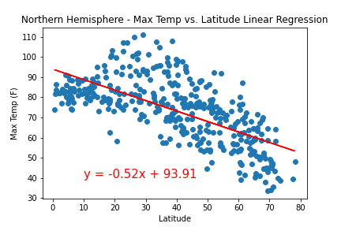
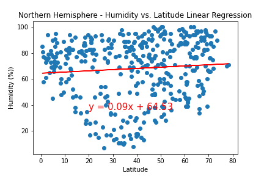

# Python API Project - What's the Weather Like?

## Task

Python requests, APIs, and JSON traversals are used to answer a fundamental question: "What's the weather like as we approach the equator?"

## Part I - WeatherPy

In this part, a Python script is created to visualize the weather of 500+ cities across the world of varying distance from the equator. To accomplish this, a [simple Python library](https://pypi.python.org/pypi/citipy), the [OpenWeatherMap API](https://openweathermap.org/api) are utilised to create a representative model of weather across world cities. For this, a series of scatter plots  are created to showcase the following relationships:

* Temperature (F) vs. Latitude
* Humidity (%) vs. Latitude
* Cloudiness (%) vs. Latitude
* Wind Speed (mph) vs. Latitude

A linear regression on each relationship is conducted, only this time separating them into Northern Hemisphere (greater than or equal to 0 degrees latitude) and Southern Hemisphere (less than 0 degrees latitude):

* Northern Hemisphere - Temperature (F) vs. Latitude
* Southern Hemisphere - Temperature (F) vs. Latitude
* Northern Hemisphere - Humidity (%) vs. Latitude
* Southern Hemisphere - Humidity (%) vs. Latitude
* Northern Hemisphere - Cloudiness (%) vs. Latitude
* Southern Hemisphere - Cloudiness (%) vs. Latitude
* Northern Hemisphere - Wind Speed (mph) vs. Latitude
* Southern Hemisphere - Wind Speed (mph) vs. Latitude

### Part II - VacationPy

Jupyter-gmaps and the Google Places API are used in working with weather data to plan future vacations.

* A heat map is created that displays the humidity for every city from the part I of the project.

  

* The DataFrame is filtered to find the ideal weather condition for vacation. For example:

  * A max temperature lower than 80 degrees but higher than 70.

  * Wind speed less than 10 mph.

  * Zero cloudiness.

* Google Places API is used to find the first hotel for each city located within 5000 meters of your coordinates.

* The hotels are placed on top of the humidity heatmap with each pin containing the **Hotel Name**, **City**, and **Country**.

  